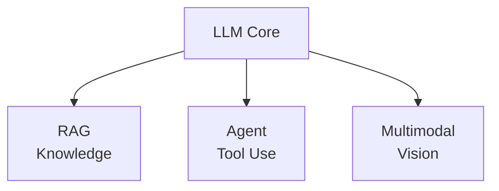

# 应用

本章聚焦大模型的三大核心应用方向：检索增强生成（RAG）、Agent 智能体和多模态大模型。这些技术将 LLM 从"语言生成器"扩展为能够检索知识、调用工具、理解图像的通用智能系统。

## 应用全景

## 章节目录

| 页面 | 核心内容 | 关键概念 |
|------|---------|---------|
| [检索增强生成 (RAG)](rag.md) | 外部知识检索与生成结合 | 向量数据库、Embedding、检索策略、Advanced RAG |
| [Agent 智能体](agents.md) | 让 LLM 自主推理与行动 | ReAct、Function Calling、Tool Use、Multi-Agent |
| [多模态大模型](multimodal.md) | 跨模态理解与生成 | ViT、CLIP、LLaVA |

## 学习建议

建议先学习 RAG，理解如何为 LLM 注入外部知识；再学习 Agent，掌握 LLM 如何通过工具与外部世界交互；最后学习多模态，了解 LLM 如何突破纯文本的限制。三个方向相互独立，也可以根据项目需要选择性学习。

> 本章假设你已理解 [Transformer 架构](/architecture/) 和 [训练方法](/training/) 的基本概念。

## 详细内容索引
<!-- AUTO-GENERATED-CONTENT-INDEX-START -->

### agent-frameworks.md — Agent 框架实战 (1066 lines)
- 在大模型体系中的位置 (L13)
- Agent 框架全景 (L31)
  - 四大主流框架对比 (L33)
- LangGraph 深度解析 (L56)
  - 核心概念 (L60)
  - State 状态模式设计 (L74)
  - 最小 LangGraph 示例 (L95)
  - 条件边 (Conditional Edge) (L120)
  - 构建 ReAct Agent (L180)
  - Memory 机制 (L226)
  - Human-in-the-loop 模式 (L289)
  - Multi-Agent 架构 (L338)
  - LangSmith 调试与监控 (L434)
- AutoGen 简介 (L454)
  - Agent 对话模式 (L458)
  - GroupChat 多代理协作 (L489)
- GraphRAG (L524)
  - 与传统 RAG 的对比 (L528)
  - GraphRAG Pipeline (L538)
- Function Calling 深度实战 (L643)
  - OpenAI / Claude / GLM 的 API 对比 (L645)
  - Tool 定义规范（JSON Schema） (L729)
  - 并行调用 / 多步调用 (L781)
- 代码实战：带记忆的多工具 Agent (L825)
- 苏格拉底时刻 (L994)
- 常见问题 & 面试考点 (L1011)
  - 面试高频问题 (L1013)
- 推荐资源 (L1049)

### agents.md — Agent 智能体 (1542 lines)
- 在大模型体系中的位置 (L13)
- Agent 的核心概念 (L28)
  - 什么是 LLM Agent (L30)
  - Agent = LLM + Memory + Tools + Planning (L34)
- ReAct 框架 (L53)
  - Reasoning + Acting (L55)
  - 思考-行动-观察循环 (L70)
  - ReAct 的完整实现 (L82)
  - ReAct 的局限性 (L200)
- Function Calling (L207)
  - OpenAI Function Calling 协议 (L209)
  - Tool 定义格式 (JSON Schema) (L222)
  - 模型如何学会调用工具 (L272)
  - 并行 Function Calling (L310)
- 工具使用 (Tool Use) (L321)
  - 常见工具类型 (L323)
  - 工具选择策略 (L333)
  - 搜索工具实现示例 (L352)
- Planning 能力 (L383)
  - Chain-of-Thought (CoT) (L385)
  - Tree-of-Thought (ToT) (L400)
  - Plan-and-Solve (L420)
- Memory 机制 (L453)
  - 短期记忆 (Context Window) (L455)
  - 长期记忆 (向量数据库) (L467)
  - 对话摘要 (L496)
- Multi-Agent 系统 (L507)
  - 多智能体协作模式 (L509)
  - 角色分工 (L543)
  - 通信协议 (L571)
  - 代表性框架 (L579)
- Agent 评估与安全 (L588)
  - Agent Bench (L590)
  - 工具调用安全 (L602)
  - 幻觉与错误传播 (L641)
- 苏格拉底时刻 (L658)
- Function Calling 深度实战 (L682)
  - Function Calling 的本质 (L684)
  - OpenAI Function Calling API 完整示例 (L702)
  - 并行函数调用（Parallel Function Calling） (L805)
  - 多步骤函数调用链 (L844)
  - 错误处理和重试策略 (L891)
  - tool_choice 参数详解 (L966)
- Human-in-the-loop 模式 (L977)
  - 为什么需要人机协作 (L979)
  - 审批模式（Approval Pattern） (L1003)
  - 中断/恢复机制 (L1105)
  - 反馈循环：人类纠正与 Agent 学习 (L1166)
  - 实际应用场景 (L1206)
- Multi-Agent 架构深度 (L1216)
  - Supervisor 模式（中心协调者） (L1218)
  - Hierarchical 模式（分层管理） (L1278)
  - Peer-to-Peer 模式（平等协作） (L1303)
  - 三种模式对比 (L1349)
  - 通信协议 (L1359)
  - 代码示例：简单的双 Agent 协作系统 (L1400)
- 常见问题 & 面试考点 (L1515)
- 推荐资源 (L1533)

### hands-on-project.md — 端到端实战项目 (487 lines)
- 项目一：从零搭建 RAG 应用 (L11)
  - 目标 (L13)
  - 整体架构 (L17)
  - 第一步：文档分块 (L35)
  - 第二步：向量化与索引 (L85)
  - 第三步：检索 (L124)
  - 第四步：生成回答 (L156)
- 参考资料 (L176)
- 用户问题 (L180)
- 回答""" (L184)
  - 第五步：整合为完整类 (L206)
- 项目二：LoRA 微调实战 (L249)
  - 目标 (L251)
  - LoRA 原理回顾 (L255)
  - 第一步：准备环境和数据 (L265)
  - 第二步：加载模型和 LoRA 配置 (L304)
  - 第三步：训练 (L347)
  - 第四步：推理验证 (L383)
  - 第五步：效果评估 (L420)
- 环境要求 (L455)
- 苏格拉底时刻 (L470)
- 推荐资源 (L480)

### harness-engineering.md — Harness 工程 (377 lines)
- 在大模型体系中的位置 (L14)
- 核心概念 (L25)
  - 什么是 Harness？ (L27)
  - 三阶段演进 (L35)
  - 四个层次的工程对比 (L43)
- Harness 的六大核心组件 (L53)
  - 1. 记忆与上下文管理 (L57)
  - 2. 工具编排 (L92)
  - 3. 状态持久化 (L100)
  - 4. 验证与反馈循环 (L113)
  - 5. 安全与护栏 (L138)
  - 6. 生命周期管理 (L153)
- 五个通用设计原则 (L157)
  - 原则一：情境必须对 Agent 可见且可发现 (L161)
  - 原则二：约束用机械手段强制执行 (L172)
  - 原则三：给地图不给说明书 (L178)
  - 原则四：验证必须独立于 Agent 的生成过程 (L184)
  - 原则五：持续清理，不让熵积累 (L194)
- Harness 架构分类 (L202)
- 术语辨析 (L227)
- 从最小回路到生产系统 (L238)
- 跨领域 Harness 设计清单 (L253)
- 行业关键里程碑 (L283)
  - 厚 Harness vs 薄 Harness 之争 (L294)
- Harness 与 Agent 的本质区别 (L302)
- 开源 Harness 生态 (L319)
- 苏格拉底时刻 (L329)
- 面试考点 (L343)
- 推荐资源 (L368)

### multimodal.md — 多模态大模型 (828 lines)
- 为什么需要多模态？ (L11)
- ViT（Vision Transformer）深度解析 (L20)
  - ViT 的工作流程 (L24)
  - Patch Embedding 实现 (L35)
  - Position Embedding 与 [CLS] Token (L63)
  - ViT 的关键设计总结 (L101)
  - ViT 的启示 (L110)
- CLIP（对比语言-图像预训练）深度解析 (L114)
  - 双编码器架构 (L118)
  - 对比学习损失 InfoNCE (L136)
  - Temperature 参数的作用 (L171)
  - Zero-Shot 分类原理 (L180)
  - 简化 CLIP 对比学习代码实战 (L218)
- LLaVA（大语言与视觉助手）深度解析 (L268)
  - LLaVA 架构详解 (L272)
  - Visual Instruction Tuning：两阶段训练 (L296)
  - LLaVA 的设计洞察 (L329)
- 国产多模态模型 (L336)
  - Qwen-VL（通义千问视觉） (L338)
  - InternVL (L352)
  - 多模态模型的演进 (L365)
- 多模态训练的关键挑战 (L378)
  - 模态对齐（Modality Alignment） (L380)
  - 多模态数据构建 (L394)
  - 多模态幻觉（Hallucination） (L410)
- 原生多模态（Native Multimodal）：从「拼接」到「同源」 (L429)
  - 晚融合 vs 原生（早融合） (L433)
  - Qwen2-VL 的「动态分辨率 + M-RoPE」 (L454)
  - GPT-4o 的「同源 token」推测 (L488)
  - 路线对比一览 (L498)
- 视频理解：从单帧到时序 (L509)
  - 帧采样策略 (L513)
  - Video-LLaVA 的「统一编码」思路 (L531)
  - 时序建模：Token Merging 与 Temporal Attention (L544)
  - 长视频的「分层摘要」思路 (L571)
- 音频与语音：从 Whisper 到 Qwen-Audio (L588)
  - Qwen-Audio 的「Whisper + LLM」结构 (L595)
  - 端到端语音对话：GPT-4o 路线 (L618)
- Vision Agent：让 LLM 看屏幕、点按钮 (L642)
  - OmniParser 的屏幕解析管线 (L646)
  - Vision Agent 的 Reward 设计 (L668)
- 多模态对齐：RM、DPO、Hallucination 缓解 (L682)
  - 多模态 RM 的两条路线 (L686)
  - 多模态 DPO (L716)
  - 缓解多模态幻觉的工程手段 (L746)
- 苏格拉底时刻 (L777)
- 推荐资源 (L792)
  - 原生多模态 / 视频 / 音频 (L804)
  - Vision Agent (L816)
  - 多模态对齐 / RM / DPO (L822)

### prompt-engineering.md — Prompt Engineering (962 lines)
- 在大模型体系中的位置 (L13)
- Prompt 的本质 (L30)
  - 四大组成要素 (L32)
  - 从信息论角度理解 Prompt (L53)
- 基础技巧 (L63)
  - Zero-shot Prompting (L65)
  - Few-shot Prompting (L91)
  - Chain-of-Thought (CoT) (L127)
- 高级技巧 (L164)
  - Self-Consistency（自洽性解码） (L166)
  - Tree-of-Thoughts (ToT) (L207)
  - ReAct（Reasoning + Acting） (L279)
  - Automatic Prompt Optimization (APO) (L340)
- 结构化输出引导 (L409)
  - JSON Mode (L411)
  - Outlines 库：基于 FSM 的受限生成 (L437)
  - LMQL：LLM 的查询语言 (L461)
- Prompt 模板设计模式 (L480)
  - Chat Template：System / User / Assistant (L482)
  - Prompt 模板工厂 (L522)
- In-Context Learning 的原理与局限 (L565)
  - ICL 是什么？ (L567)
  - ICL 的两种假说 (L571)
  - ICL 的局限 (L587)
- 常见陷阱 (L597)
  - 位置偏差 (Positional Bias) (L599)
  - Lost in the Middle (L632)
  - 长上下文退化 (L654)
- DSPy 框架简介 (L695)
  - 核心概念 (L699)
  - 代码示例 (L711)
- 代码实战：多步 CoT 推理 Pipeline (L756)
- 苏格拉底时刻 (L894)
- 常见问题 & 面试考点 (L911)
  - 面试高频问题 (L913)
- 推荐资源 (L945)

### rag.md — RAG 检索增强生成 (1196 lines)
- 在大模型体系中的位置 (L13)
- 为什么需要 RAG？ (L28)
  - LLM 的知识边界 (L30)
  - Fine-tuning vs RAG 的对比 (L39)
- RAG 基础架构 (L52)
  - Index → Retrieve → Generate (L54)
- 文本切分 (Chunking) (L76)
  - 固定大小切分 (L80)
  - 语义切分 (L101)
  - 递归切分 (L134)
  - Chunk 大小对检索质量的影响 (L149)
- 嵌入模型 (Embedding) (L159)
  - 什么是文本嵌入 (L163)
  - 主流嵌入模型对比 (L178)
  - 嵌入质量的重要性 (L188)
- 向量数据库 (L213)
  - FAISS (Facebook AI Similarity Search) (L215)
  - Milvus (L237)
  - Chroma (L241)
  - 索引类型 (L262)
- 检索策略 (L273)
  - Dense Retrieval（向量检索） (L275)
  - Sparse Retrieval（BM25） (L291)
  - Hybrid Search（混合检索） (L313)
  - Re-ranking (L332)
- Advanced RAG (L353)
  - Query Rewriting / HyDE (L357)
  - Self-RAG（自我反思检索） (L377)
  - Graph RAG (L393)
  - Agentic RAG (L410)
  - 完整 RAG Pipeline 代码 (L428)
- RAG 评估 (L503)
  - 检索质量评估 (L505)
  - 生成质量评估 (RAGAS) (L513)
  - 端到端评估 (L524)
- 苏格拉底时刻 (L549)
- GraphRAG (L573)
  - 传统 RAG 的局限 (L575)
  - GraphRAG 核心流程 (L585)
  - GraphRAG vs 传统 RAG 对比 (L783)
  - Microsoft GraphRAG 实践要点 (L795)
- RAG 评估体系 (L802)
  - 检索评估指标 (L804)
  - 生成评估指标 (L838)
  - 端到端评估：Ragas 框架 (L868)
  - DeepEval 评估框架 (L915)
  - 评估指标选择指南 (L949)
- RAG 常见问题与优化 (L960)
  - PDF 解析难题 (L962)
  - 长文本切分策略选择 (L1000)
  - 负样本挖掘提升检索精度 (L1028)
  - RAG-Fusion（多查询 + RRF 排序） (L1057)
  - 多模态 RAG（图片 + 文本混合检索） (L1102)
- 常见问题 & 面试考点 (L1169)
- 推荐资源 (L1187)

<!-- AUTO-GENERATED-CONTENT-INDEX-END -->
