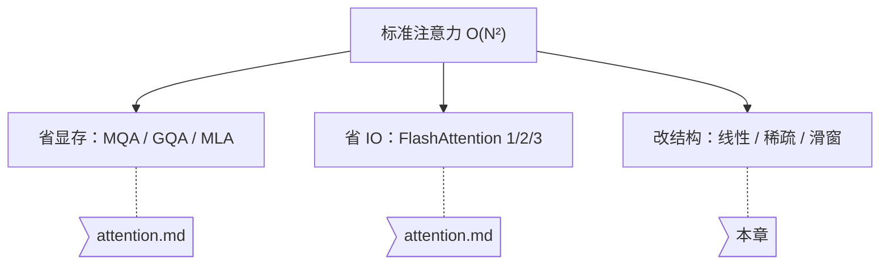

# 高效注意力：线性、稀疏与混合

::: info 一句话总结
FlashAttention 让 $O(N^2)$ 跑得更快，但没有让它不再是 $O(N^2)$。2025 年之后，各大实验室开始动结构本身——用线性注意力、稀疏注意力和混合层来换掉一部分标准注意力，而且**至今没有达成共识**。
:::

## 在大模型体系中的位置

[注意力机制](attention.md) 那一章讲的是"如何把标准注意力算得更省"：MQA/GQA 压 KV 头数、MLA 压 KV 维度、FlashAttention 压 IO。这些优化有一个共同点——**它们都保留了完整的 $QK^\top$ 计算**，省的是常数因子和显存，复杂度依然是序列长度的平方。



本章讨论的是第三条路：**接受一定的信息损失，把复杂度本身降下来。**

## 为什么 2025 年之后注意力重新成为战场

标准注意力的两笔账，在长上下文和 Agent 场景下都爆了：

**第一笔是计算账。** Prefill 阶段要算 $N \times N$ 的注意力矩阵，$N$ 翻倍则计算量翻四倍。128K 上下文的 prefill 成本已经让很多应用无法接受。

**第二笔是显存账，而且更致命。** Decode 阶段每生成一个 token 都要读一遍完整的 KV Cache，KV Cache 大小随上下文**线性增长**。decode 是 memory-bound 的（见 [推理优化](/engineering/inference)），上下文越长，每个 token 的生成就越慢——不是因为算得多，而是因为搬得多。

Agent 的普及把第二笔账推到了极限。一个跑 ReAct 循环的 Agent，几十轮工具调用下来轻松堆到几十万 token 的历史，而它每生成一个 token 都要把这几十万 token 的 KV 重读一遍。

::: tip 关键区分
**FlashAttention 解决的是 IO，不是复杂度。** 它通过分块和 Online Softmax 避免把 $N \times N$ 矩阵写回 HBM，但该算的 $N^2$ 次乘加一次都没少。要真正突破，必须让模型**少看一些 token**——问题只在于"少看哪些"。
:::

三条答案，对应三条技术路线：

| 路线 | 思路 | 复杂度 | 代表 |
|------|------|--------|------|
| **线性化** | 去掉 softmax，把注意力变成可递推的固定大小状态 | $O(N)$ | Gated DeltaNet（Qwen3.5） |
| **稀疏化** | 保留 softmax，但只对筛选出的少数 token 计算 | $O(Nk)$ | DSA（DeepSeek-V3.2） |
| **滑窗 + 混合** | 大部分层只看局部窗口，少数层看全局 | $O(NW)$ | Mistral、Gemma、各家 hybrid |

---

## 路线一：线性注意力与 Delta Rule

### 从 softmax 注意力到线性注意力

标准注意力的瓶颈藏在一个容易被忽略的地方——**矩阵乘法的结合律被 softmax 挡住了**。

$$
\text{Attn}(Q,K,V) = \text{softmax}\!\left(\frac{QK^\top}{\sqrt{d}}\right)V
$$

因为 softmax 是逐行的非线性操作，你**必须**先算出 $QK^\top$（$N \times N$）才能做 softmax。但如果把 softmax 换成一个可分解的特征映射 $\phi(\cdot)$：

$$
\text{LinAttn}(Q,K,V) = \phi(Q)\left(\phi(K)^\top V\right)
$$

结合律就解锁了。$\phi(K)^\top V$ 的形状是 $d \times d$，**与序列长度无关**。计算量从 $O(N^2 d)$ 降到 $O(N d^2)$——当 $N \gg d$ 时，这是数量级的差别。

### 状态空间视角：注意力变回了 RNN

对因果（causal）场景，上面的式子可以写成递推形式。记 $S_t = \sum_{i \le t} k_i v_i^\top$ 为第 $t$ 步的**状态矩阵**：

$$
S_t = S_{t-1} + k_t v_t^\top, \qquad o_t = S_t^\top q_t
$$

这就是一个 RNN：固定大小的状态 $S$（$d_k \times d_v$），每步 $O(d^2)$ 更新。

**这个形式的意义非常大：推理时不再需要 KV Cache。** 无论上下文多长，显存里只有一个固定大小的 $S$。上下文从 8K 涨到 1M，decode 阶段的显存占用和单步延迟**完全不变**。

::: warning 天下没有免费的午餐
固定大小的状态意味着**信息一定会丢**。标准注意力的 KV Cache 是无损的——第 1 个 token 和第 100 万个 token 被同等精确地保存着。线性注意力把整个历史压进一个 $d \times d$ 矩阵，压缩比随上下文增长而恶化。这正是"大海捞针"类长文本精确检索任务上，纯线性注意力模型普遍偏弱的原因。
:::

### Delta Rule：让状态能"改写"而不只是"累加"

纯线性注意力还有一个更微妙的毛病：**它只会加，不会改。**

$S_t = S_{t-1} + k_t v_t^\top$ 是纯累加的。如果序列里先出现"张三的电话是 111"，后来又出现"张三的电话改成 222"，两条信息会**叠加**在同一个 key 方向上，读出来是一团糨糊。模型无法覆盖旧值。

Delta Rule 的修正来自经典的误差驱动学习：写入之前，**先把该 key 上已有的旧值减掉**。

$$
S_t = S_{t-1} + \beta_t \left(v_t - S_{t-1}k_t\right)k_t^\top
$$

括号里 $v_t - S_{t-1}k_t$ 正是"想写入的值"与"当前已存的值"之差——delta。$\beta_t \in (0,1)$ 是写入强度。当 $\beta_t = 1$ 时，这一步精确地把 $k_t$ 方向上的内容替换成 $v_t$。

展开后等价于 $S_t = S_{t-1}(I - \beta_t k_t k_t^\top) + \beta_t v_t k_t^\top$——前半项是一个**定向擦除**算子，只擦 $k_t$ 这个方向，其他方向不动。

### Gated DeltaNet：再加一道全局闸门

Delta Rule 解决了"定向改写"，但还缺"整体遗忘"——很久以前的信息应该自然衰减。Mamba2 的门控衰减机制正好补上这一块。**Gated DeltaNet 是两者的结合**，也是 Qwen3-Next 和 Qwen3.5 采用的方案：

$$
S_t = \alpha_t \, S_{t-1}\left(I - \beta_t k_t k_t^\top\right) + \beta_t v_t k_t^\top
$$

两个门各司其职：

- $\alpha_t \in (0,1)$：**全局衰减**，整个状态按比例淡出，实现"时间久了就忘"
- $\beta_t$：**定向写入**，只在 $k_t$ 方向上做精确覆盖

下面是一个可跑的最小实现，直接对照上面的公式：

```python
import torch

def gated_delta_rule(q, k, v, alpha, beta):
    """Gated DeltaNet 的朴素递推实现（教学版，非并行化）

    q, k: (B, T, d_k)   v: (B, T, d_v)
    alpha, beta: (B, T) —— 全局衰减门 / 定向写入门，均在 (0, 1)
    返回: (B, T, d_v)
    """
    B, T, d_k = q.shape
    d_v = v.shape[-1]
    # 状态矩阵：把 key 方向映射到 value 方向
    S = torch.zeros(B, d_k, d_v, dtype=q.dtype, device=q.device)
    outputs = []

    for t in range(T):
        k_t = k[:, t]                      # (B, d_k)
        v_t = v[:, t]                      # (B, d_v)
        a_t = alpha[:, t].unsqueeze(-1)    # (B, 1)
        b_t = beta[:, t].unsqueeze(-1)     # (B, 1)

        # 1) 全局衰减
        S = a_t.unsqueeze(-1) * S

        # 2) 读出 k_t 方向上已存的旧值
        v_old = torch.einsum('bkd,bk->bd', S, k_t)   # (B, d_v)

        # 3) delta = 想写的 - 已存的，只在 k_t 方向上修正
        delta = b_t * (v_t - v_old)                  # (B, d_v)
        S = S + torch.einsum('bk,bd->bkd', k_t, delta)

        # 4) 用 q_t 读出
        outputs.append(torch.einsum('bkd,bk->bd', S, q[:, t]))

    return torch.stack(outputs, dim=1)


# 验证「定向改写」：同一个 key 写两次，第二次应该覆盖第一次
torch.manual_seed(0)
B, T, d = 1, 2, 4
key = torch.nn.functional.normalize(torch.randn(1, d), dim=-1)

q = key.unsqueeze(1).repeat(1, T, 1)                    # 两步都查同一个 key
k = key.unsqueeze(1).repeat(1, T, 1)                    # 两步都写同一个 key
v = torch.tensor([[[1., 0., 0., 0.], [0., 1., 0., 0.]]])  # 先写 v1，再写 v2
alpha = torch.ones(B, T)                                # 不衰减，隔离出 delta 的效果
beta = torch.ones(B, T)                                 # 全强度写入

out = gated_delta_rule(q, k, v, alpha, beta)
print(out[0, 1])   # ≈ [0, 1, 0, 0] —— 读到的是 v2，v1 被干净地覆盖了
```

把 `beta` 全改成 `0.5`，你会看到第二步读出的是 v1 和 v2 的混合——这正是没有 Delta Rule 的纯线性注意力的行为。

::: details 为什么实际实现不是这样的 for 循环？
上面的逐步递推在 GPU 上极慢——$T$ 步串行，完全吃不到并行度。真实实现用的是 **chunk-wise 并行**：把序列切成固定大小的块，块**内**用矩阵乘法并行计算（形式接近标准注意力），块**间**串行传递状态 $S$。这样既保留了 $O(N)$ 的复杂度，又把并行度提到了可用水平。`flash-linear-attention` 库提供了这类算子的 Triton 实现。
:::

---

## 路线二：稀疏注意力与 DeepSeek DSA

线性注意力是"把历史压成一个状态"，稀疏注意力走的是另一个极端：**历史完整保留，但每次只看其中一小部分。**

### 基本思想与真正的难点

对每个 query，从 $N$ 个历史 token 里挑出最相关的 $k$ 个（$k \ll N$），只在这 $k$ 个上做标准 softmax 注意力。复杂度从 $O(N^2)$ 降到 $O(Nk)$，而且因为被选中的部分走的是**完整的 softmax 注意力**，精度损失通常小于线性注意力。

难点全在"怎么挑"上，这是一个鸡生蛋的问题：**要知道哪些 token 重要，似乎就得先算出注意力分数——而那正是我们想避免的 $O(N^2)$。**

早期方案靠固定模式绕开它（局部窗口 + 少量全局 token，如 Longformer、BigBird），但固定模式与内容无关，该看的看不到。

### DSA 的解法：lightning indexer

DeepSeek 在 **DeepSeek-V3.2-Exp**（2025-09-29 发布，基于 V3.1-Terminus 继续训练）里给出的答案是 **DSA（DeepSeek Sparse Attention）**：用一个**极轻量的索引器**先算一遍粗糙分数，再用这个分数挑 top-k。

关键在于索引器和主注意力的**不对称**——索引器可以用低得多的维度、更少的头、甚至更低的精度，因为它只需要把相关的 token **排进 top-k**，不需要精确的注意力权重。挑出来之后，真正的注意力计算才用全精度、全维度在那 $k$ 个 token 上做。

```python
import torch
import torch.nn.functional as F

def sparse_attention(q, k, v, q_idx, k_idx, top_k):
    """DSA 风格的两阶段稀疏注意力（教学简化版，单头、无因果掩码外的优化）

    q, k, v       : (B, T, d)      —— 主注意力的全精度表示
    q_idx, k_idx  : (B, T, d_idx)  —— 索引器的低维表示，d_idx << d
    top_k         : 每个 query 保留的 key 数量
    """
    B, T, d = q.shape

    # --- 阶段一：轻量索引，O(T² · d_idx)，d_idx 很小所以便宜 ---
    idx_scores = torch.einsum('bqc,bkc->bqk', q_idx, k_idx)

    causal = torch.ones(T, T, dtype=torch.bool, device=q.device).tril()
    idx_scores = idx_scores.masked_fill(~causal, float('-inf'))

    # 每个 query 选出自己的 top-k key（内容相关，而非固定模式）
    kth = idx_scores.topk(min(top_k, T), dim=-1).values[..., -1:]
    keep = idx_scores >= kth                      # (B, T, T) 稀疏掩码

    # --- 阶段二：只在被选中的位置做全精度注意力 ---
    scores = torch.einsum('bqd,bkd->bqk', q, k) / d ** 0.5
    scores = scores.masked_fill(~(keep & causal), float('-inf'))
    return torch.einsum('bqk,bkd->bqd', F.softmax(scores, dim=-1), v)
```

::: warning 这段代码是为了讲清楚机制，不是为了省算力
上面阶段二仍然把完整的 $QK^\top$ 算了出来再 mask 掉——这在教学上直观，但**一点算力都没省**。真实的 DSA kernel 会用 top-k 的索引做 **gather**，只把选中的 $k$ 个 key/value 取进 SRAM 参与计算，这样 $O(Nk)$ 才真正落地。稀疏注意力的收益高度依赖 kernel 实现，这也是它比线性注意力更晚普及的原因。
:::

### 效果与代价

DeepSeek 官方公告称 DSA "在长上下文场景下大幅提升训练与推理效率、显著降低计算成本"，并在发布当天**将 API 价格下调 50% 以上**——对于一个公司愿意直接反映到定价上的优化，这是相当强的信号。第三方技术分析进一步报告了相比全注意力约 **75% 的 KV Cache 缩减**与最高 **6 倍的 decode 吞吐提升**。

代价也很清楚：**top-k 选择是不可微的硬选择**，训练需要特殊处理；而且 DSA 是在一个已经训练好的稠密模型上**继续训练**得到的，不是从零训练——这条路径本身就说明了稀疏化训练的难度。

---

## 路线三：滑动窗口与混合层

第三条路最朴素，也最先被工业界大规模采用：**大部分 token 其实只需要看附近。**

### 滑动窗口注意力

每个 token 只注意最近的 $W$ 个 token（Mistral 用 4096，Gemma 用 1024 级别）。复杂度 $O(NW)$，而且 KV Cache 可以做成**环形缓冲区**——只保留最近 $W$ 个，显存占用有上限，不随上下文增长。

窗口之外的信息并非完全不可达：**感受野随层数累积**。第 1 层每个位置看到 $W$ 个 token，第 2 层看到的每个位置又各自看过 $W$ 个，以此类推——$L$ 层之后理论感受野是 $L \times W$。这和 CNN 靠堆叠扩大感受野是同一个道理。

```python
def sliding_window_mask(T, window, device=None):
    """滑动窗口 + 因果掩码：只允许注意 [t-window+1, t]"""
    idx = torch.arange(T, device=device)
    dist = idx[:, None] - idx[None, :]          # dist[i, j] = i - j
    return (dist >= 0) & (dist < window)        # 因果 且 在窗口内
```

但"理论感受野"和"实际能用的信息"是两回事——跨层传递的信息经过多次混合，早已不是原始内容。**指望纯滑窗模型做精确的长程检索是不现实的。**

### 混合：这才是真正的工业答案

所以没有人只用滑窗。现代做法是**分层混合**：大部分层用便宜的机制（滑窗或线性），少数层保留完整的全局注意力，专门负责长程精确检索。

Qwen3.5 的配比是 **3:1**——每四个 block 里三个用 Gated DeltaNet，第四个用全注意力。Gemma 系列则是滑窗层与全局层交替。

::: tip 混合比例是一个经验超参
3:1 不是推导出来的，是搜出来的。全注意力层太少，长程检索能力塌方；太多，效率收益被吃掉。这个比例还与任务分布有关——检索密集的任务需要更多全注意力层。它是当前这批模型的**经验选择**，不是定论。
:::

---

## 2026 年各家的选择

这是本章最值得记住的一张表——**同一个问题，五个顶级实验室给出了五个不同的答案**：

| 模型 | 注意力方案 | 押注的方向 |
|------|-----------|-----------|
| **Qwen3.5**（397B-A17B） | Gated DeltaNet + 全注意力，3:1 混合 | 线性混合，极致长上下文效率 |
| **DeepSeek-V3.2** | MLA + DSA 稀疏注意力 | 稀疏，保留 softmax 精度 |
| **GLM-5** | MLA + DSA | 跟进稀疏路线 |
| **Kimi K2.5** | MLA | 稳扎稳打，只压 KV 维度 |
| **MiniMax-M2.5** | 标准 MHA（全注意力） | **反向押注**：可靠性优先 |

两个值得注意的细节。

**DeepSeek 的影响力远超其模型本身。** MLA 出现在 Kimi K2.5 和 GLM-5 里，DSA 也被 GLM-5 直接采用——一家公司的两个注意力设计成了竞争对手的标配。

**MiniMax-M2.5 的"倒退"是深思熟虑的。** 在所有人都往高效注意力跑的时候，它回到了最朴素的 MHA。理由是 Agent 工作负载对**可靠性**的要求高于对效率的要求：一个会在长轨迹中悄悄丢失关键信息的模型，省下来的算力毫无意义。有意思的是，MiniMax 自己的上一代 M1 恰恰是线性注意力的先行者之一——这是一次基于实际经验的回撤。

::: info 这一章为什么没有"正确答案"
Maxime Labonne 在 2026 年的分析里把这个局面总结为一句话：**"注意力机制成了新的战场。"** 不是因为技术不成熟，而是因为**取舍的权重取决于你想赢的是什么**——长上下文效率、精确检索能力、训练稳定性、Agent 可靠性，这几项之间存在真实的张力。读这一章，重点不是记住谁用了什么，而是理解**每个选择放弃了什么**。
:::

---

## 苏格拉底时刻

::: details 问题一：线性注意力的状态矩阵是 $d \times d$，与上下文长度无关。那为什么不干脆把 $d$ 调大，直到它能无损保存所有信息？
先算一笔账：无损保存 $N$ 个 token 的 KV，需要的容量约为 $N \times d$。而状态矩阵的容量是 $d^2$。要让 $d^2 \ge N d$，就需要 $d \ge N$。

也就是说，要在 1M 上下文上做到无损，状态矩阵的维度得开到 100 万——此时每步 $O(d^2)$ 的更新成本是 $10^{12}$，比标准注意力还贵得多。

**线性注意力的全部收益都来自"$d \ll N$ 的有损压缩"。** 一旦要求无损，它就退化回了标准注意力，且常数更差。这是信息论层面的硬约束，不是工程优化能绕开的——也正是混合架构存在的根本原因：既然压缩必然有损，那就留几层全注意力专门处理"不能损"的那部分。
:::

::: details 问题二：Delta Rule 里的 $\beta_t$ 如果恒等于 1，会发生什么？这是好事还是坏事？
$\beta_t = 1$ 时更新变成 $S_t = S_{t-1}(I - k_tk_t^\top) + v_tk_t^\top$——每次写入都**完全擦除** $k_t$ 方向上的旧值。

在"后面的信息应该覆盖前面的"场景下（比如变量重新赋值），这是好事，覆盖得干脆利落。

但在需要**累积**的场景下这是灾难。比如模型在统计某个实体出现了多少次，或者要把散落在多处的线索合并起来——如果这些信息恰好映射到相近的 key 方向，每条新信息都会把前面的擦掉，最后只剩最后一条。

所以 $\beta_t$ 必须是**数据相关的可学习门控**：模型自己判断这一步是"覆盖"还是"补充"。这也解释了为什么 Gated DeltaNet 要同时保留 $\alpha_t$ 和 $\beta_t$——衰减和覆盖是两种不同的遗忘，不能合并成一个门。
:::

::: details 问题三：DSA 的 lightning indexer 本身也要算 query 和所有历史 key 的分数，这不还是 $O(N^2)$ 吗？
是的，索引阶段确实是 $O(N^2 \cdot d_{\text{idx}})$——**稀疏注意力并没有消除平方项，只是让平方项的系数变得极小。**

收益来自两个不对称。一是**维度不对称**：$d_{\text{idx}} \ll d$，索引器可能只用几十维而主注意力用几千维，同样是 $N^2$ 次运算，成本差两个数量级。二是**精度不对称**：索引器只需要把相关 token 排进 top-k，排序对数值误差远比 softmax 权重宽容，所以可以用低精度算。

真正被消除的平方项在**显存**上：DSA 的 KV Cache 读取量从 $O(N)$ 降到 $O(k)$，而 decode 阶段是 memory-bound 的——这才是 6 倍吞吐提升的来源。**看懂这一点，就明白为什么推理优化必须先分清 compute-bound 和 memory-bound。**
:::

---

## 常见问题 & 面试考点

**Q：线性注意力和 Mamba/SSM 是什么关系？**

数学上高度重合。把线性注意力写成递推形式 $S_t = S_{t-1} + k_tv_t^\top$ 后，它就是一个状态空间模型；Mamba 的核心贡献之一是给状态转移加上**数据相关的**门控（selective SSM）。Gated DeltaNet 直接借用了 Mamba2 的门控衰减，再叠加 Delta Rule。二者是同一个"RNN 化注意力"家族的不同分支，近年的趋势是互相吸收。

**Q：为什么混合架构不用"前面几层全注意力、后面全线性"这种切法？**

实践中交替（interleave）效果显著更好。全局信息在整个深度上都需要被反复调用，而不是只在某一段。把全注意力层集中在一端，相当于让另一端彻底失去长程访问能力。

**Q：稀疏注意力和线性注意力，该选哪个？**

看你怕什么。怕**长上下文的显存和延迟**——线性更彻底，KV Cache 直接归零。怕**精度损失，尤其是精确检索**——稀疏更稳，因为被选中的 token 走的是完整 softmax。工业界目前两条路都在走，而且都要配全注意力层兜底。

**Q：这些新架构对推理框架意味着什么？**

意味着 PagedAttention 那套假设要重写。vLLM 的分页管理是为"KV Cache 随上下文线性增长"设计的，而线性注意力根本没有 KV Cache，混合模型则是**同一个模型里两种内存模型并存**——有的层需要分页 KV，有的层只需要一个固定状态。这是当前推理框架适配新架构的主要工程难点。

**Q：GQA/MLA 和本章的方法能叠加吗？**

能，而且实际就是这么用的。它们作用在不同维度上：GQA/MLA 压的是**单个 token 的 KV 表示大小**，本章的方法减的是**需要参与计算的 token 数量**。DeepSeek-V3.2 的 `MLA + DSA` 正是两者叠乘——先把每个 token 的 KV 压小，再只看其中一部分。

---

## 推荐资源

### 论文

- [Transformers are RNNs: Fast Autoregressive Transformers with Linear Attention](https://arxiv.org/abs/2006.16236)（arXiv:2006.16236）——线性注意力的奠基工作，结合律与递推形式的来源
- [Parallelizing Linear Transformers with the Delta Rule over Sequence Length](https://arxiv.org/abs/2406.06484)（arXiv:2406.06484）——DeltaNet，以及 chunk-wise 并行化方案
- [Gated Delta Networks: Improving Mamba2 with Delta Rule](https://arxiv.org/abs/2412.06464)（arXiv:2412.06464）——Gated DeltaNet 原始论文
- [Mamba: Linear-Time Sequence Modeling with Selective State Spaces](https://arxiv.org/abs/2312.00752)（arXiv:2312.00752）——选择性 SSM
- [Longformer](https://arxiv.org/abs/2004.05150) / [Big Bird](https://arxiv.org/abs/2007.14062)——固定模式稀疏注意力的经典方案
- [Mistral 7B](https://arxiv.org/abs/2310.06825)（arXiv:2310.06825）——滑动窗口注意力的工业级验证

### 官方发布与技术分析

- [Introducing DeepSeek-V3.2-Exp](https://api-docs.deepseek.com/news/news250929/)——DSA 官方公告（2025-09-29）
- [Qwen3.5: Towards Native Multimodal Agents](https://qwen.ai/blog?id=qwen3.5)——Qwen3.5 官方博客
- [Qwen3.5: Nobody Agrees on Attention Anymore](https://huggingface.co/blog/mlabonne/qwen35)——Maxime Labonne 对 2026 年各家注意力方案的横向对比
- [From DeepSeek V3 to V3.2: Architecture, Sparse Attention, and RL Updates](https://sebastianraschka.com/blog/2025/technical-deepseek.html)——Sebastian Raschka 的 DSA 技术拆解

### 代码参考

- [fla-org/flash-linear-attention](https://github.com/fla-org/flash-linear-attention)——线性注意力家族的 Triton 算子实现（DeltaNet、Gated DeltaNet、RWKV 等）
- [state-spaces/mamba](https://github.com/state-spaces/mamba)——Mamba/Mamba2 官方实现
- [deepseek-ai/DeepSeek-V3.2-Exp](https://github.com/deepseek-ai/DeepSeek-V3.2-Exp)——DSA 官方推理实现与 kernel
