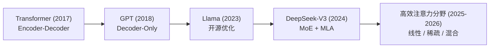

# 模型架构

本章深入解读大语言模型的核心架构，从基础的 Transformer 出发，逐步演进到 GPT、Llama、DeepSeek-V3，直至 2025-2026 年的高效注意力之争。

## 架构演进路线

> **内容新鲜度**：本章知识锚点更新至 **2026 年 9 月**。前六节讲的是已经稳定下来的架构基础，十年内不会过时；最后一节[高效注意力](efficient-attention.md)讲的是**正在发生、尚未收敛**的技术分歧，请对照各家官方发布阅读。

## 章节导航

| 主题 | 核心内容 | 关键创新 |
|------|---------|---------|
| [Transformer](transformer.md) | 完整的 Encoder-Decoder 架构 | Self-Attention、位置编码 |
| [注意力机制](attention.md) | 注意力的各种变体与优化 | Multi-Head、Flash Attention |
| [分词器](tokenization.md) | 文本到 Token 的转换 | BPE、SentencePiece |
| [解码策略](decoding.md) | 从概率分布生成文本 | Top-k/Top-p、Temperature |
| [GPT 架构](gpt.md) | Decoder-Only 语言模型 | Pre-Norm、KV Cache |
| [Llama 架构](llama.md) | Meta 开源大模型系列 | RoPE、RMSNorm、GQA |
| [DeepSeek-V3 架构](deepseek.md) | 国产高性能大模型 | MoE、MLA、Multi-Token Prediction |
| [高效注意力](efficient-attention.md) | 2025-2026 年的三条突围路线 | 线性注意力、Delta Rule、DSA 稀疏、滑窗混合 |

## 学习建议

> 建议按顺序阅读：先理解 Transformer 和注意力机制的基础，再看各架构如何在此基础上创新。分词器和解码策略可以穿插阅读。

## 详细内容索引
<!-- AUTO-GENERATED-CONTENT-INDEX-START -->

### attention.md — 注意力机制 (1112 lines)
- 在大模型体系中的位置 (L11)
- Scaled Dot-Product Attention (L31)
  - 核心公式 (L33)
  - 为什么要除以 $\sqrt{d_k}$？——方差证明 (L45)
  - 代码实现 (L83)
- Multi-Head Attention (MHA) (L137)
  - 核心思想 (L139)
  - 完整过程：拆分 → 并行计算 → 拼接 (L153)
- Multi-Query Attention (MQA) 与 Grouped-Query Attention (GQA) (L186)
  - 演进动机 (L188)
  - MQA：所有 Q 头共享 1 组 KV (L194)
  - GQA：分组共享 KV（Llama 2/3 采用） (L221)
- Multi-Latent Attention (MLA) (L275)
  - DeepSeek 的创新思路 (L277)
  - 代码实现（对照 DeepSeek-V3 官方） (L293)
  - 矩阵吸收技巧（推理优化） (L359)
- Flash Attention (L371)
  - GPU 内存层次：SRAM vs HBM (L373)
  - 标准 Attention 的 IO 瓶颈 (L380)
  - Flash Attention 的分块策略 + Online Softmax (L390)
- Flash Attention 深度实现 (L509)
  - 核心算法：Online Softmax 与分块计算 (L511)
  - 前向传播伪代码 (L531)
  - PyTorch 实现 (L557)
  - 反向传播：重计算 vs 存储 (L644)
  - Flash Attention 2 的优化 (L665)
  - IO 复杂度分析 (L700)
  - 面试考点：为什么 Flash Attention 更快但 FLOPs 相同？ (L722)
  - Online Softmax：从两遍扫描到一遍扫描 (L733)
  - Flash Attention 反向传播 (L803)
  - 用 PyTorch Autograd 验证正确性 (L916)
- Tensor Product Attention (TPA) (L941)
  - 核心思想 (L943)
  - 数学公式 (L947)
  - 简化版代码实现 (L963)
  - TPA vs 标准 Attention 对比 (L1013)
- 注意力变体对比 (L1025)
- 苏格拉底时刻 (L1047)
- 常见问题 & 面试考点 (L1061)
- 推荐资源 (L1080)
  - 论文 (L1082)
  - 博客与可视化 (L1091)
  - 代码参考 (L1096)

### decoding.md — 解码策略 (487 lines)
- 在大模型体系中的位置 (L11)
- 核心概念 (L25)
  - Greedy Search（贪心搜索） (L27)
  - Beam Search（束搜索） (L49)
  - Temperature（温度参数） (L70)
  - Top-k Sampling（Top-k 采样） (L86)
  - Top-p / Nucleus Sampling（核采样） (L101)
  - 各策略对比总结 (L127)
  - 进阶话题：重复惩罚与停止条件 (L138)
- 代码实战 (L146)
  - 统一的采样框架 (L150)
  - Beam Search 从零实现 (L201)
  - 完整运行示例：对比四种策略 (L265)
- 实战复现：可视化解码树 (L313)
  - 环境准备（Cell 1） (L317)
  - 共享设置（Cell 3） (L324)
  - Greedy Search 的递归实现（Cell 5） (L341)
  - Beam Search 的累积评分（Cell 8-9） (L367)
  - Top-k：硬截断 + 温度缩放（Cell 12） (L406)
  - Nucleus：动态截断（Cell 16） (L419)
  - 跑通建议 (L443)
- 苏格拉底时刻 (L450)
- 常见问题 & 面试考点 (L460)
- 推荐资源 (L467)
  - 论文 (L469)
  - 博客与可视化 (L475)
  - 代码参考 (L481)

### deepseek.md — DeepSeek-V3 架构 (449 lines)
- 在大模型体系中的位置 (L11)
- 核心概念 (L23)
  - MoE 混合专家（Mixture of Experts） (L25)
  - 负载均衡（Load Balance） (L147)
  - MLA 多头潜在注意力（Multi-head Latent Attention） (L175)
  - Multi-Token Prediction（多 Token 预测） (L255)
- 完整 DeepSeek-V3 Block (L372)
- 苏格拉底时刻 (L422)
- 常见问题 & 面试考点 (L432)
- 推荐资源 (L441)

### efficient-attention.md — 高效注意力：线性、稀疏与混合 (373 lines)
- 在大模型体系中的位置 (L14)
- 为什么 2025 年之后注意力重新成为战场 (L31)
- 路线一：线性注意力与 Delta Rule (L55)
  - 从 softmax 注意力到线性注意力 (L57)
  - 状态空间视角：注意力变回了 RNN (L73)
  - Delta Rule：让状态能"改写"而不只是"累加" (L89)
  - Gated DeltaNet：再加一道全局闸门 (L105)
- 路线二：稀疏注意力与 DeepSeek DSA (L181)
  - 基本思想与真正的难点 (L185)
  - DSA 的解法：lightning indexer (L193)
  - 效果与代价 (L232)
- 路线三：滑动窗口与混合层 (L240)
  - 滑动窗口注意力 (L244)
  - 混合：这才是真正的工业答案 (L260)
- 2026 年各家的选择 (L272)
- 苏格拉底时刻 (L296)
- 常见问题 & 面试考点 (L326)
- 推荐资源 (L350)
  - 论文 (L352)
  - 官方发布与技术分析 (L361)
  - 代码参考 (L368)

### flow-matching.md — Flow Matching (518 lines)
- 在大模型体系中的位置 (L13)
- 1. 从 Diffusion 到 Flow Matching (L38)
  - 1.1 Diffusion 回顾 (L40)
  - 1.2 Flow Matching 的核心思想 (L85)
  - 1.3 关键区别对比 (L106)
- 2. 数学基础 (L119)
  - 2.1 常微分方程（ODE） (L121)
  - 2.2 概率路径 (L135)
  - 2.3 速度场（Velocity Field） (L156)
- 3. Conditional Flow Matching (CFM) (L176)
  - 3.1 为什么需要 "Conditional"？ (L178)
  - 3.2 CFM 目标函数 (L184)
  - 3.3 训练算法 (L210)
  - 3.4 采样算法 (L226)
- 4. Rectified Flow (L241)
  - 4.1 直线路径的优势 (L243)
  - 4.2 Reflow 操作 (L262)
  - 4.3 一步生成的可能性 (L272)
- 5. 代码实现 (L286)
  - 5.1 基础 Flow Matching（2D 演示） (L288)
  - 5.2 Conditional Flow Matching（带条件） (L368)
- 6. 在 LLM 中的应用 (L427)
  - 6.1 从连续到离散：离散 Flow Matching (L429)
  - 6.2 与自回归 LLM 的对比 (L462)
  - 6.3 未来展望 (L472)
- 苏格拉底时刻 (L483)
- 推荐资源 (L507)

### gpt.md — GPT 架构 (482 lines)
- 在大模型体系中的位置 (L11)
- 核心概念 (L22)
  - Decoder-Only vs Encoder-Decoder (L24)
  - GELU 激活函数 (L62)
  - Pre-Normalization（预归一化） (L110)
  - KV Cache 原理与实现 (L182)
- 代码实战：完整 GPT-2 模型 (L287)
  - Perplexity（困惑度）计算 (L405)
- 苏格拉底时刻 (L441)
- 常见问题 & 面试考点 (L450)
- 推荐资源 (L457)
  - 论文 (L459)
  - 博客与可视化 (L465)
  - 代码参考 (L470)

### llama.md — Llama 架构 (557 lines)
- 在大模型体系中的位置 (L11)
- 核心概念 (L24)
  - RoPE 旋转位置编码 (L26)
  - 长上下文扩展：从 4K 到 128K+ (L91)
  - RMSNorm（对比 LayerNorm） (L251)
  - GQA 分组查询注意力 (L293)
  - SwiGLU 门控激活 (L386)
- 完整 Llama Block (L418)
- 苏格拉底时刻 (L480)
- 常见问题 & 面试考点 (L490)
- 推荐资源 (L497)
  - 论文 (L499)
  - 代码参考 (L508)

### scaling-laws.md — Scaling Laws (295 lines)
- 在大模型体系中的位置 (L11)
- 核心概念：幂律关系 (L31)
  - 基本形式 (L33)
  - 计算量公式 (L45)
- Kaplan Scaling Laws (2020) (L63)
  - 来源 (L65)
  - 核心发现 (L69)
  - Kaplan 的经验公式 (L75)
- Chinchilla Scaling Laws (2022) (L87)
  - DeepMind 的挑战 (L89)
  - 核心发现 (L93)
  - Chinchilla 最优比例 (L103)
  - Chinchilla vs GPT-3 (L114)
  - 为什么 Kaplan 和 Chinchilla 结论不同？ (L126)
- 后 Chinchilla 时代：推理最优 (L139)
  - 过训练（Over-training）策略 (L141)
  - DeepSeek 的 Scaling Laws 研究 (L160)
- 涌现能力（Emergent Abilities） (L168)
  - 什么是涌现 (L170)
  - 涌现是真的吗？ (L179)
- 实用意义 (L195)
  - 如何估算训练成本 (L197)
  - 用小模型预测大模型性能 (L239)
- 苏格拉底时刻 (L266)
- 常见问题 & 面试考点 (L276)
- 推荐资源 (L288)

### tokenization.md — 分词器 (310 lines)
- 在大模型体系中的位置 (L11)
- 核心概念 (L29)
  - 为什么需要分词 (L31)
  - 分词粒度：字符、词、子词 (L37)
  - BPE 算法（Byte Pair Encoding） (L47)
  - WordPiece (L86)
  - SentencePiece (L97)
  - 中文分词的特殊挑战 (L109)
- 代码实战 (L119)
  - 第一步：统计相邻对频率 (L125)
  - 第二步：执行合并 (L137)
  - 第三步：BPE 训练 (L155)
  - 第四步：编码（文本 → Token ID 序列） (L206)
  - 第五步：解码（Token ID 序列 → 文本） (L220)
  - 完整运行示例 (L229)
- 苏格拉底时刻 (L266)
- 常见问题 & 面试考点 (L276)
- 推荐资源 (L283)
  - 代码参考 (L291)

### transformer.md — Transformer 架构 (532 lines)
- 在大模型体系中的位置 (L13)
- 从宏观到微观：Transformer 的整体结构 (L25)
- 自注意力机制（Self-Attention） (L50)
  - 从直觉出发 (L52)
  - 数学推导 (L62)
  - 为什么要除以 $\sqrt{d_k}$？——方差分析 (L81)
  - 注意力实现代码 (L90)
- 多头注意力（Multi-Head Attention） (L140)
  - 为什么需要多头？ (L142)
  - 多头如何工作？ (L146)
  - 多头注意力实现 (L156)
- 前馈神经网络（Feed-Forward Network） (L205)
  - 结构 (L209)
  - 实现 (L218)
- 残差连接与 Layer Normalization (L236)
  - 为什么需要残差连接？ (L238)
  - LayerNorm vs BatchNorm (L244)
  - LayerNorm 实现 (L256)
  - Pre-Norm vs Post-Norm (L278)
- 位置编码（Positional Encoding） (L287)
  - 为什么需要位置编码？ (L289)
  - 正弦余弦编码 (L295)
  - 位置编码实现 (L320)
  - 位置编码的使用 (L345)
- 完整的 Transformer 实现 (L375)
  - Encoder Block (L379)
  - Decoder Block (L401)
  - 完整 Transformer (L428)
- 苏格拉底时刻 (L474)
- 常见问题 & 面试考点 (L490)
- 推荐资源 (L524)

<!-- AUTO-GENERATED-CONTENT-INDEX-END -->
