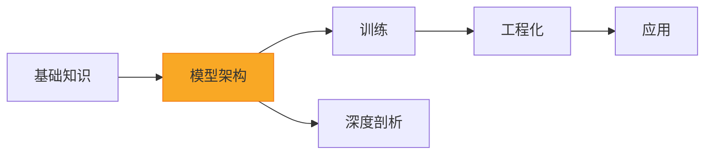

## 学习路线



| 模块 | 内容 | 适合人群 |
|------|------|---------|
| [基础知识](/fundamentals/) | 数学、Python、神经网络、NLP | 零基础入门 |
| [模型架构](/architecture/) | Transformer → GPT → Llama → DeepSeek-V3 | 所有人（核心） |
| [训练](/training/) | 预训练、SFT、RLHF/DPO/GRPO | 想训练/微调模型的人 |
| [工程化](/engineering/) | 推理优化、量化、分布式、评估 | 想部署模型的人 |
| [应用](/applications/) | RAG、Agent、多模态 | 想做应用的人 |
| [深度剖析](/deep-dives/) | 开源项目源码分析 | 想深入理解的人 |

## 推荐学习路径

### 速通路线（2 周）

适合有编程基础、想快速了解 LLM 核心技术的人：

```
数学基础(选读) → Transformer → 注意力机制 → 分词器 → GPT 架构
→ 预训练 → 推理优化 → Prompt Engineering
```

### 完整路线（2 个月）

按模块顺序学完全部内容，从零到一建立完整知识体系：

```
基础知识(全部) → 模型架构(全部) → 训练(全部) → 工程化(全部) 
→ 应用(全部) → 深度剖析 → 练习系统
```

### 面试突击（3 天）

聚焦每章的"面试考点"和"苏格拉底时刻"：

```
Day 1: Transformer + Attention + 分词器 + 解码策略（架构核心）
Day 2: 预训练 + SFT + RLHF/DPO + LoRA（训练核心）
Day 3: KV Cache + PagedAttention + 量化 + 分布式（工程核心）
```

## 项目特色

本项目的核心理念：**不只是看懂，更要写得出来**。

每个知识点都遵循：**概念理解 → 代码阅读 → 代码填空 → 独立实现** 的渐进路径。
