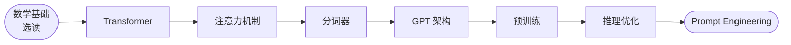
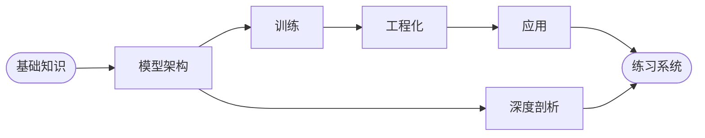
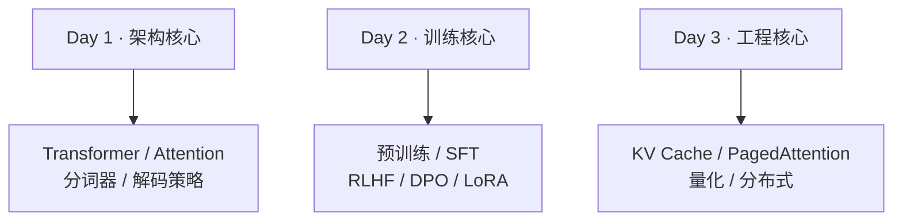

<HomeHero />

## 推荐学习路径

三条路线共用同一批内容，区别只在取哪些、按什么顺序取。

### 速通路线 · 约 2 周

适合有编程和深度学习基础、想快速建立 LLM 核心认知的人。跳过全部数学推导与训练细节。

```mermaid
flowchart LR
    A(["数学基础<br/>选读"]) --> B["Transformer"]
    B --> C["注意力机制"]
    C --> D["分词器"]
    D --> E["GPT 架构"]
    E --> F["预训练"]
    F --> G["推理优化"]
    G --> H(["Prompt Engineering"])
```

### 完整路线 · 约 2 个月

按模块顺序学完全部内容，从零建立完整知识体系。练习系统贯穿全程，不是最后才做。

```mermaid
flowchart LR
    A(["基础知识"]) --> B["模型架构"]
    B --> C["训练"]
    C --> D["工程化"]
    D --> E["应用"]
    B --> F["深度剖析"]
    E --> G(["练习系统"])
    F --> G
```

### 面试突击 · 3 天

只读每章的「常见问题 & 面试考点」和「苏格拉底时刻」两节，跳过正文推导。

```mermaid
flowchart TD
    D1["Day 1 · 架构核心"] --> D1a["Transformer / Attention<br/>分词器 / 解码策略"]
    D2["Day 2 · 训练核心"] --> D2a["预训练 / SFT<br/>RLHF / DPO / LoRA"]
    D3["Day 3 · 工程核心"] --> D3a["KV Cache / PagedAttention<br/>量化 / 分布式"]
```

## 项目理念

核心只有一句：**不只是看懂，更要写得出来。**

每个知识点都走同一条渐进路径 —— 概念理解 → 代码阅读 → 代码填空 → 独立实现。看懂一段代码和能默写出来，中间隔着的东西，正是面试和实际工作真正考察的。

本站内容开源在 [GitHub](https://github.com/boots-coder/LLM-101-CN)，欢迎提 issue 指出错误。

