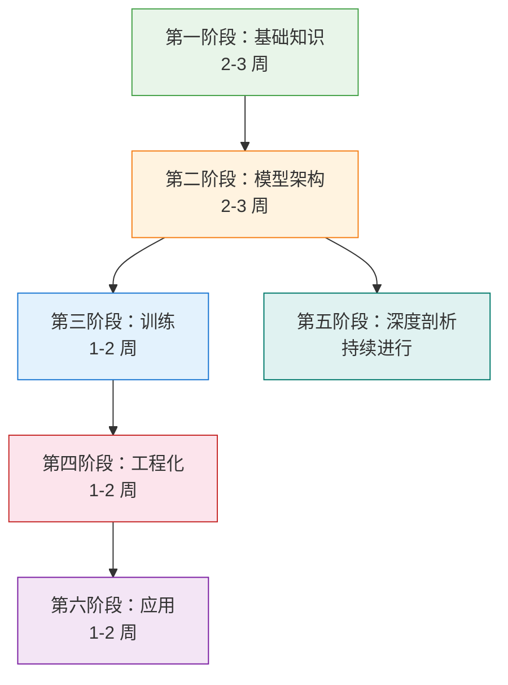

# 学习路线

本页提供推荐的学习顺序和每个模块的预估时间，帮助你制定自己的学习计划。

## 总览

整个教程预计需要 **8-12 周**（每周投入 10-15 小时）。你可以根据自身背景跳过已熟悉的模块。

---

## 第一阶段：基础知识

**预计时间：2-3 周** | **难度：入门**

> 如果你已有深度学习基础（熟悉 PyTorch、反向传播、基本 NLP），可以快速浏览或跳过本阶段。

| 序号 | 主题 | 预计时间 | 前置知识 |
|------|------|----------|----------|
| 1.1 | [数学基础](/fundamentals/math) | 6-8 小时 | 高中数学 |
| 1.2 | [Python & 机器学习](/fundamentals/python-ml) | 4-6 小时 | Python 基础 |
| 1.3 | [神经网络基础](/fundamentals/neural-networks) | 4-6 小时 | 线性代数、PyTorch |
| 1.4 | [NLP 基础概念](/fundamentals/nlp-basics) | 3-4 小时 | 神经网络 |

**阶段目标：** 能手写一个简单的前馈神经网络，理解梯度下降和反向传播的原理。

---

## 第二阶段：模型架构（核心）

**预计时间：2-3 周** | **难度：中等**

> 这是整个教程的核心模块，建议所有人认真学习，不要跳过。

| 序号 | 主题 | 预计时间 | 前置知识 |
|------|------|----------|----------|
| 2.1 | [Transformer 完全解析](/architecture/transformer) | 6-8 小时 | 神经网络、NLP 基础 |
| 2.2 | [注意力机制深入](/architecture/attention) | 4-6 小时 | Transformer |
| 2.3 | [分词器](/architecture/tokenization) | 3-4 小时 | NLP 基础 |
| 2.4 | [解码策略](/architecture/decoding) | 2-3 小时 | Transformer |
| 2.5 | [GPT 架构](/architecture/gpt) | 3-4 小时 | Transformer |
| 2.6 | [Llama 架构详解](/architecture/llama) | 4-6 小时 | GPT |
| 2.7 | [DeepSeek-V3 技术分析](/architecture/deepseek) | 4-6 小时 | Llama |

**阶段目标：** 能从零实现一个完整的 Transformer，理解主流大模型的架构设计选择。

---

## 第三阶段：训练

**预计时间：1-2 周** | **难度：中等偏高**

| 序号 | 主题 | 预计时间 | 前置知识 |
|------|------|----------|----------|
| 3.1 | [预训练流程](/training/pretraining) | 4-6 小时 | 模型架构 |
| 3.2 | [数据集构建](/training/datasets) | 3-4 小时 | NLP 基础 |
| 3.3 | [监督微调 (SFT)](/training/sft) | 3-4 小时 | 预训练 |
| 3.4 | [偏好对齐 (RLHF/DPO/GRPO)](/training/alignment) | 6-8 小时 | SFT |

**阶段目标：** 理解大模型从预训练到对齐的完整流程，能使用开源框架完成一次 SFT 微调。

---

## 第四阶段：工程化

**预计时间：1-2 周** | **难度：中等偏高**

| 序号 | 主题 | 预计时间 | 前置知识 |
|------|------|----------|----------|
| 4.1 | [推理优化](/engineering/inference) | 4-6 小时 | 模型架构 |
| 4.2 | [模型量化](/engineering/quantization) | 3-4 小时 | 线性代数、模型架构 |
| 4.3 | [分布式训练](/engineering/distributed) | 4-6 小时 | 预训练 |
| 4.4 | [模型评估](/engineering/evaluation) | 3-4 小时 | 训练 |

**阶段目标：** 能独立部署一个大模型推理服务，理解常见的性能优化手段。

---

## 第五阶段：深度剖析

**预计时间：持续进行** | **难度：高**

> 本模块可以与其他模块穿插进行，在学完相关基础后随时深入。

| 序号 | 主题 | 预计时间 | 前置知识 |
|------|------|----------|----------|
| 5.1 | 深度剖析（持续更新中） | 4-6 小时 | 模型架构 |

> 更多深度剖析文章持续更新中（vLLM 源码分析等）

**阶段目标：** 培养阅读大型开源项目源码的能力，建立工程批判性思维。

---

## 第六阶段：应用

**预计时间：1-2 周** | **难度：中等**

| 序号 | 主题 | 预计时间 | 前置知识 |
|------|------|----------|----------|
| 6.1 | [RAG 检索增强生成](/applications/rag) | 4-6 小时 | 模型架构 |
| 6.2 | [Agent 智能体](/applications/agents) | 4-6 小时 | RAG |
| 6.3 | [多模态大模型](/applications/multimodal) | 4-6 小时 | 模型架构 |

**阶段目标：** 能构建一个基于 RAG 的问答系统或简单的 Agent 应用。

---

## 不同背景的推荐路径

### 计算机专业学生（有编程基础）

快速浏览第一阶段 → 重点学习第二、三阶段 → 选修第四、五、六阶段

**预计时间：6-8 周**

### AI/ML 从业者（有深度学习经验）

跳过第一阶段 → 重点学习第二阶段 → 根据工作需要选修后续模块

**预计时间：4-6 周**

### 完全零基础的初学者

按顺序从第一阶段开始，不要跳过任何模块

**预计时间：10-12 周**

---

## 学习建议

1. **动手优先**：每学完一个概念就运行配套代码，不要只看不练。
2. **做好笔记**：用自己的话复述学到的内容，这是检验理解程度的最好方式。
3. **善用练习系统**：从选择题开始，逐步过渡到代码填空和完整实现。
4. **不要赶进度**：宁可一个模块学透，也不要囫囵吞枣地赶完全部内容。
5. **参与社区**：在 GitHub Issues 中提问和讨论，和其他学习者互相帮助。
