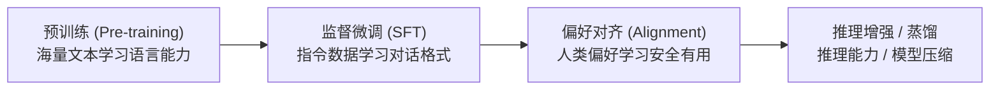

# 模型训练

本章覆盖大语言模型从预训练到对齐的完整训练流程，帮助你理解如何将一个随机初始化的模型训练成有用的 AI 助手。

## 学习路线

| 主题 | 核心内容 | 预计时间 |
|------|---------|---------|
| [预训练](pretraining.md) | 大规模语料上的自监督训练 | 1-2 周 |
| [数据集构建](datasets.md) | 数据收集、清洗、格式化 | 1 周 |
| [监督微调 (SFT)](sft.md) | 指令跟随能力的注入 | 1 周 |
| [偏好对齐](alignment.md) | RLHF、DPO 等对齐技术 | 1-2 周 |
| [推理模型](reasoning.md) | O1/R1 范式、PRM、MCTS | 1-2 周 |
| [知识蒸馏](distillation.md) | 大模型能力迁移到小模型 | 1 周 |

## 训练三阶段

> 理解这三个阶段的目标差异是把握大模型训练全貌的关键：预训练赋予模型"知识"，SFT 教会模型"格式"，对齐让模型"听话且安全"。

## 详细内容索引
<!-- AUTO-GENERATED-CONTENT-INDEX-START -->

### agent-rl.md — Agent 强化学习 (757 lines)
- 在大模型体系中的位置 (L11)
- 为什么需要 Agent-RL？ (L31)
  - 静态对齐的局限 (L33)
  - Agent-RL 的核心洞察 (L45)
- Agent-RL 核心架构 (L70)
  - 经典 Agent-RL 循环 (L72)
  - 三大核心组件 (L89)
- 训练算法 (L129)
  - GRPO for Agents (L133)
  - PPO for Agents (L186)
  - GRPO vs PPO：Agent-RL 场景下的选择 (L223)
  - Agent-RL 与文本 GRPO 的关键差异 (L238)
- Rollout 生成 (L250)
  - 同步 Rollout (L254)
  - 异步 Rollout (L268)
  - SGLang 高吞吐推理 (L315)
  - 多轮轨迹：Agent Rollout 的特殊结构 (L348)
- 奖励设计 (L378)
  - Rule-based Rewards（规则奖励） (L382)
  - Verifiable Environments (RLVE) (L420)
  - Process Rewards vs Outcome Rewards (L446)
- 生产级训练框架：slime 架构 (L458)
  - 整体架构 (L462)
  - 三大模块详解 (L487)
  - 参数同步与 Colocate 模式 (L540)
  - 支持的模型 (L562)
- Agentic Training 的特殊挑战 (L570)
  - 1. 长轨迹问题 (L574)
  - 2. 稀疏奖励与信用分配 (L586)
  - 3. 环境多样性 (L620)
  - 4. 异步解耦 (L629)
  - 5. 训练加速 (L640)
- 实际应用案例 (L648)
  - P1：物理奥赛推理 (L652)
  - RLVE：400 个可验证环境 (L659)
  - TritonForge：训练模型写 GPU Kernel (L667)
  - OpenClaw-RL：个性化对话 Agent (L674)
  - qqr (ArenaRL)：开放式 Agent 进化 (L681)
- Agent-RL vs 传统对齐 (L688)
- 苏格拉底时刻 (L705)
- 面试考点 (L717)
- 推荐资源 (L745)

### alignment-advanced.md — 对齐进阶 (343 lines)
- 在大模型体系中的位置 (L11)
- Constitutional AI (CAI) (L26)
  - 核心思想 (L28)
  - 宪法示例 (L51)
  - 为什么 CAI 重要 (L61)
- RLAIF：AI 反馈替代人类反馈 (L75)
  - 从 RLHF 到 RLAIF (L77)
  - RLAIF 的效果 (L105)
  - 局限性 (L113)
- Reward Hacking (L121)
  - 什么是 Reward Hacking (L123)
  - 为什么会发生 (L136)
  - 缓解策略 (L148)
- 对齐税（Alignment Tax） (L174)
  - 有用性 vs 安全性的矛盾 (L176)
  - 如何降低对齐税 (L200)
- 可扩展监督（Scalable Oversight） (L229)
  - 问题定义 (L231)
  - 当前的研究方向 (L237)
- Red Teaming：对抗测试 (L260)
  - 什么是 Red Teaming (L262)
  - 常见攻击类型 (L266)
  - 自动化 Red Teaming (L276)
- 苏格拉底时刻 (L312)
- 常见问题 & 面试考点 (L322)
- 推荐资源 (L335)

### alignment.md — 偏好对齐 (1773 lines)
- 在大模型体系中的位置 (L11)
- RLHF 概述 (L26)
  - Bradley-Terry 偏好模型 (L36)
- Reward Model 训练 (L50)
  - 模型架构 (L52)
  - 训练（含 Margin Loss） (L76)
  - LLaMA 2 的双奖励选择 (L105)
  - 奖励后处理：Whiten + KL 惩罚 (L172)
- PPO (Proximal Policy Optimization) (L192)
  - RLHF-PPO 需要四个模型 (L196)
  - PPO 训练流程 (L233)
  - 把 KL 惩罚揉进 token 级 reward (L276)
  - GAE 优势估计 (L303)
  - PPO 的两个 loss (L336)
  - 最小可跑 PPO 一步：演示 ratio → clip → GAE → loss 计算链路 (L379)
  - 代码参考：DS-Chat 与 trlx (L481)
- DPO (Direct Preference Optimization) (L552)
  - 从 RLHF 到 DPO 的数学推导 (L556)
  - DPO 损失的直觉 (L582)
  - PyTorch 实现 DPO (L596)
  - 主流框架的 DPO loss 入口 (L636)
  - 最小可跑 DPO：笔记本本地 < 1 分钟 (L655)
  - DPO 的过拟合问题与 IPO (L766)
- GRPO (Group Relative Policy Optimization) (L780)
  - GRPO 损失函数 (L784)
  - 步骤 1：Group Sampling（组采样） (L790)
  - 步骤 2：可验证奖励（Verifiable Reward） (L827)
  - 步骤 3：组内相对优势（Group-Relative Advantage） (L855)
  - 步骤 4：GRPO Loss (L882)
  - 工程实现参考 (L919)
  - 最小可跑 GRPO：笔记本本地 < 1 分钟 (L955)
  - 代码参考：minimind 的 GRPO + CISPO 实现 (L1067)
- GRPO 中的 KL 散度分析 (L1094)
  - 三种 KL 估计方式 (L1098)
  - 为什么 K3 恒为正？ (L1110)
  - GRPO 使用 K3 的原因 (L1136)
- KTO (Kahneman-Tversky Optimization) (L1155)
  - 动机：为什么不需要成对数据？ (L1159)
  - 前景理论 (Prospect Theory) 的启发 (L1169)
  - 数学公式 (L1182)
  - 数据格式 (L1207)
  - KTO 损失函数实现 (L1228)
  - KTO vs DPO 对比 (L1281)
- 各方法对比 (L1300)
- 更多对齐算法 (L1316)
  - ORPO (Odds Ratio Preference Optimization) (L1320)
  - CPO (Contrastive Preference Optimization) (L1347)
  - RLOO (REINFORCE Leave-One-Out) (L1359)
  - Online DPO (L1371)
  - PRM (Process Reward Model) (L1383)
- Constitutional AI / RLAIF (L1412)
  - 两阶段流程 (L1418)
  - 宪法原则示例 (L1440)
  - 与 RLHF 的对比 (L1450)
- TRL 实战：对齐训练实现 (L1465)
  - DPO 训练 (L1469)
  - GRPO 训练 (L1498)
  - PPO 训练 (L1529)
  - 奖励函数设计模式 (L1565)
  - 补充：Rubric as Reward（RaR）—— RLVR 在不可验证领域的推广 (L1600)
  - 补充：RLVER 案例 —— 把"对话效果"操作化为可验证情感分 (L1653)
- 对齐算法选择指南 (L1693)
- 苏格拉底时刻 💡 (L1726)
- 常见问题 & 面试考点 (L1734)
- 推荐资源 (L1741)
  - 论文 (L1743)
  - 博客与可视化 (L1754)
  - 代码参考 (L1763)

### continue-pretraining.md — 继续预训练 (316 lines)
- 在大模型体系中的位置 (L11)
- 为什么需要继续预训练 (L26)
  - 通用 LLM 在专业领域的局限 (L28)
  - 一个直观的例子 (L37)
- CPT vs SFT vs RAG：三种领域适配方案 (L50)
- 实现：继续预训练的关键技术 (L68)
  - 数据准备 (L70)
  - 学习率策略：低 LR Warmup (L86)
  - 灾难性遗忘的缓解 (L107)
- 代码示例：基于 HuggingFace Trainer 的 CPT Pipeline (L127)
  - 进阶：课程学习策略 (L233)
- 领域案例 (L248)
  - 医学领域 (L250)
  - 法律领域 (L257)
  - 代码领域 (L264)
- 苏格拉底时刻 (L282)
- 常见问题 & 面试考点 (L296)
- 推荐资源 (L309)

### datasets.md — 数据集构建 (517 lines)
- 在大模型体系中的位置 (L10)
- 预训练数据 vs 后训练数据 (L23)
- 预训练数据集构建 (L38)
  - 数据来源与规模 (L40)
  - 数据清洗流水线 (L54)
- SFT 数据格式 (L142)
  - Alpaca 格式 (L144)
  - ShareGPT 格式 (L158)
  - OpenAI 格式 (L174)
  - Chat Template (L188)
- 合成数据生成 (L241)
  - Self-Instruct (L243)
  - Evol-Instruct (WizardLM) (L260)
  - 使用 GPT-4 / Claude 生成数据的最佳实践 (L284)
  - Seed Task 设计 (L292)
  - 质量把控 (L303)
- 数据增强技术 (L317)
  - Rejection Sampling (L319)
  - Chain-of-Thought 扩展 (L337)
  - 多样性增强 (Persona-driven) (L349)
  - 难度递增 (Auto-Evol) (L361)
- 偏好数据构建 (L373)
  - Chosen/Rejected pair 的收集 (L375)
  - 人工标注 vs 模型标注 (L389)
  - Bradley-Terry 模型的数据需求 (L399)
- 数据质量评估 (L413)
  - 自动评估指标 (L415)
  - Reward Model 打分 (L425)
  - 去重与去污染验证 (L439)
- 苏格拉底时刻 (L464)
- 常见问题 & 面试考点 (L478)
- 推荐资源 (L493)
  - 论文 (L495)
  - 博客与技术报告 (L504)
  - 代码参考 (L511)

### distillation.md — 知识蒸馏 (616 lines)
- 在大模型体系中的位置 (L11)
- 蒸馏的动机 (L27)
  - 为什么需要蒸馏？ (L29)
  - 蒸馏的本质：暗知识（Dark Knowledge） (L40)
- 经典知识蒸馏（Hinton 2015） (L56)
  - 核心框架 (L58)
  - Temperature Scaling (L72)
  - 完整数学推导 (L114)
  - PyTorch 实现 (L161)
- LLM 时代的蒸馏方法 (L211)
  - 黑盒蒸馏：数据驱动 (L215)
  - 白盒蒸馏：知识深度对齐 (L246)
  - 推理蒸馏：蒸馏 CoT 能力 (L292)
  - On-Policy Distillation：让学生在自己的 rollout 上被打分 (L309)
- 实用蒸馏流水线 (L323)
  - 数据生成流水线 (L325)
  - 训练策略 (L370)
- Alpaca / Vicuna 等项目的蒸馏实践 (L395)
  - Alpaca：指令数据蒸馏的先驱 (L397)
  - Vicuna：对话数据蒸馏 (L411)
  - 蒸馏的法律和伦理问题 (L420)
- 蒸馏 vs LoRA vs 量化 (L431)
- 代码实战：用 Temperature Scaling 实现简单蒸馏 (L459)
- 苏格拉底时刻 (L565)
- 常见问题 & 面试考点 (L573)
- 推荐资源 (L581)
  - 代码参考：minimind 的白盒蒸馏 (L593)

### pretraining.md — 预训练 (1028 lines)
- 在大模型体系中的位置 (L11)
- 预训练的本质 (L27)
  - Next Token Prediction 目标 (L29)
  - Causal Language Modeling vs Masked Language Modeling (L110)
  - 预训练赋予模型什么能力？ (L122)
- Scaling Laws (L134)
  - Kaplan et al. (2020) 的发现 (L136)
  - Chinchilla 法则 (L154)
  - 对实践的指导意义 (L175)
  - Scaling Laws 深度：从理论到实践 (L183)
- 数据准备 (L445)
  - 数据来源 (L447)
  - 数据清洗流水线 (L462)
  - FineWeb 与 RedPajama (L481)
  - 数据配比 (L492)
- 优化器 (L512)
  - AdamW 详解 (L514)
  - 学习率调度 (L627)
- Mixed Precision Training (L685)
  - FP32, FP16, BF16 的精度对比 (L687)
  - Loss Scaling 技巧 (L695)
  - 为什么 BF16 比 FP16 更适合训练 (L705)
- Gradient Checkpointing (L719)
  - 内存 vs 计算的 trade-off (L721)
  - 实现原理 (L727)
- 训练监控 (L743)
  - 关键指标：loss, grad norm, learning rate (L745)
  - Loss Spike 的处理 (L776)
  - MFU (Model FLOPs Utilization) 的计算 (L786)
- 预训练实战 (L800)
  - 完整训练配置示例 (L802)
  - 最小可跑预训练：笔记本本地 < 1 分钟 (L838)
  - 训练成本估算 (L942)
- 苏格拉底时刻 (L959)
- 常见问题 & 面试考点 (L973)
- 推荐资源 (L988)
  - 论文 (L990)
  - 数据集 (L998)
  - 代码参考 (L1002)

### reasoning.md — 推理模型 (1286 lines)
- 在大模型体系中的位置 (L11)
- 从 System 2 Thinking 到 Test-time Compute Scaling (L27)
- Reasoning Token 与 Chain-of-Thought (L44)
  - 什么是 Reasoning Token？ (L46)
- Process Reward Model (PRM) (L67)
  - ORM vs PRM (L69)
  - PRM 的数学形式 (L90)
  - PRM 训练数据构建（PRM800K） (L114)
  - PRM 模型架构 (L131)
- Monte Carlo Tree Search (MCTS) (L159)
  - MCTS 核心思想 (L161)
  - MCTS 四步循环 (L178)
  - 代码示例：简化版 MCTS for LLM Reasoning (L196)
  - MCTS 在推理模型中的应用 (L271)
- GRPO for Reasoning（DeepSeek-R1 方案） (L282)
  - 无需 Reward Model 的 RL 训练 (L284)
  - R1 多阶段训练的真实细节（论文 §3.2） (L300)
  - 规则奖励函数设计 (L352)
  - "Aha Moment" 涌现 (L384)
  - GRPO 推理训练核心逻辑 (L412)
  - Reward 设计模式：6 个值得收藏的奖励函数 (L458)
- Qwen3 Hybrid Thinking：思考/直答合一与思考预算 (L639)
- 推理蒸馏 (L685)
  - 用大推理模型的 CoT 教小模型 (L687)
  - 蒸馏 vs RL 的效果对比 (L702)
- Scaling Law for Test-time Compute (L711)
- 代码实战：PRM 训练 + MCTS 搜索 + Best-of-N 采样 (L730)
  - Part 1：PRM 训练代码实战 (L740)
  - Part 2：MCTS 搜索实现——完整四步循环 (L852)
  - Part 3：PRM 引导的逐步验证搜索 (L1041)
  - Part 4：端到端示例——用 MCTS + PRM 解 GSM8K 数学题 (L1125)
- 苏格拉底时刻 (L1255)
- 常见问题 & 面试考点 (L1263)
- 推荐资源 (L1271)
  - 论文与博客 (L1273)
  - 代码参考 (L1283)

### rl-basics.md — 强化学习基础 (860 lines)
- 在大模型体系中的位置 (L11)
- 1. RL 核心概念 (L23)
  - 1.1 Agent-Environment 交互 (L25)
  - 1.2 核心术语表 (L41)
  - 1.3 MDP 框架 (L53)
  - 1.4 累积回报 (Return) (L73)
- 2. Bellman 方程 (L84)
  - 2.1 Value Function 的递推关系 (L86)
  - 2.2 Bellman 最优方程 (L108)
  - 2.3 代码验证：手算 Bellman 方程 (L124)
- 3. 动态规划 (L167)
  - 3.1 Policy Evaluation（策略评估） (L171)
  - 3.2 Policy Iteration（策略迭代） (L179)
  - 3.3 Value Iteration（值迭代） (L185)
  - 3.4 代码：4x4 Grid World 的 Value Iteration (L195)
- 4. Monte Carlo 方法 (L248)
  - 4.1 First-Visit MC 估计 $V^\pi$ (L252)
  - 4.2 MC 估计 $Q^\pi$ + epsilon-Greedy 改进 (L295)
- 5. 时序差分 (Temporal Difference) (L340)
  - 5.1 TD(0) (L344)
  - 5.2 SARSA（On-Policy TD Control） (L354)
  - 5.3 Q-Learning（Off-Policy TD Control） (L393)
  - 5.4 SARSA vs Q-Learning：On-Policy vs Off-Policy (L430)
- 6. DQN：从 Q-Learning 到深度强化学习 (L444)
  - 6.1 为什么需要 DQN？ (L446)
  - 6.2 两个关键技巧 (L450)
  - 6.3 DQN 完整实现 (L468)
- 7. Policy Gradient (L553)
  - 7.1 从 Value-Based 到 Policy-Based (L555)
  - 7.2 策略梯度定理 (L564)
  - 7.3 对数导数技巧 (Log-Derivative Trick) 推导 (L578)
  - 7.4 REINFORCE 算法 (L618)
  - 7.5 从 REINFORCE 到 PPO 的演化 (L701)
- 8. 从 RL 到 RLHF 的桥梁 (L727)
  - 8.1 LLM 生成 = RL 序贯决策 (L729)
  - 8.2 RLHF 的 RL 视角 (L741)
  - 8.3 为什么需要 KL 惩罚？ (L760)
- 9. RL 方法总览 (L777)
- 苏格拉底时刻 (L800)
- 面试考点 (L811)
- 推荐资源 (L848)

### sft.md — 监督微调 (748 lines)
- 在大模型体系中的位置 (L11)
- 什么是监督微调？ (L22)
  - 预训练模型的"复读机"问题 (L24)
  - SFT 的核心思路 (L40)
- Full Fine-tuning (L61)
- LoRA：低秩适配 (L82)
  - 核心原理 (L84)
  - PyTorch 实现 LoRA (L98)
  - 替换模型中的 Linear 层 (L127)
  - 关键参数详解 (L146)
  - 使用 PEFT 库（推荐生产用法） (L162)
- QLoRA：量化 + LoRA (L180)
  - 三大技术 (L184)
  - 实现 QLoRA 核心：量化线性层 (L190)
  - QLoRA = 量化 + LoRA (L221)
  - Transformers 快捷调用 (L233)
- SFT 数据集准备 (L256)
  - 数据格式对比 (L258)
  - Chat Template 与 Label Masking（核心思想） (L274)
- 最小可跑 SFT：笔记本本地 < 1 分钟 (L283)
  - Step 1：准备模型与微型数据集 (L289)
  - Step 2：Tokenize 并对 prompt 段做 label masking (L313)
  - Step 3：Collate + 单步 loss 验证 (L336)
  - Step 4：训练循环 (L355)
  - Step 5：训练前后输出对比 (L377)
- 训练参数调优指南 (L403)
- TRL SFTTrainer 实战 (L422)
  - 基本用法 (L426)
  - Chat Template 处理 (L449)
  - 数据格式详解 (L457)
  - Packing（序列打包） (L478)
  - LoRA 集成 (L501)
- 多轮对话训练 (L524)
  - 数据格式 (L528)
  - 训练要点 (L543)
- 训练加速与显存优化 (L563)
  - Gradient Checkpointing (L567)
  - Mixed Precision 混合精度训练 (L580)
  - DeepSpeed ZeRO (L595)
  - Gradient Accumulation (L610)
  - Flash Attention (L621)
  - vLLM 集成 (L640)
- 苏格拉底时刻 💡 (L655)
- 常见问题 & 面试考点 (L662)
- 推荐资源 (L669)
  - 论文 (L671)
  - 博客与实证研究 (L677)
  - 代码参考 (L684)
  - 生产级对照：LLaMA-Factory（封装层，非手撕） (L711)

<!-- AUTO-GENERATED-CONTENT-INDEX-END -->
